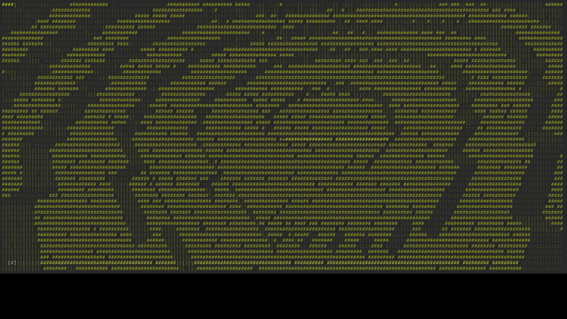

# asciicraft

Minecraft-like voxel world that runs entirely inside a terminal, using only POSIX library. Everything is calculated by the CPU and rendered using ASCII characters and ANSI color sequences. 



### World Structure
The world is managed as a one-dimensional array of **Chunks**. Each chunk is a 16x16x16 cube of voxels, where each individual voxel takes up just one byte to store its ID (Air, Grass, Cobblestone, or Sand).

I implemented a small optimization called `solidCount` for each chunk. Essentially, I keep track of how many solid blocks are in a section. If a chunk contains only air, the rendering algorithm skips it instantly. This saves a massive amount of CPU cycles during raycasting. The terrain generation itself is handled by 2D Perlin noise, which determines the height and biome for every column.

### Rendering System: Two-Level DDA
To "draw" the view on the terminal, I cast a ray for every single character on the screen. Instead of checking every single coordinate in space (which would be way too heavy for a CPU), I use the **DDA (Digital Differential Analyzer)** algorithm.

To keep it fast, the process happens on two levels:
1. **Chunk Level**: The ray travels through the world by "jumping" from chunk to chunk. If it hits a chunk where `solidCount > 0`, it enters the second level.
2. **Voxel Level**: The ray then checks the individual blocks inside that specific chunk until it hits something solid.

Once a collision happens, I calculate which face of the cube was hit (X, Y, or Z) to apply different shading. Finally, I pick the best ASCII character based on distance and the brightness of the face.

### Input Handling and Fluidity
Handling terminal input in C is tricky because the terminal usually waits for the "Enter" key to read data. This is called Canonical Mode.
To fix this, I set the terminal to **Raw Mode** and use `poll()`. This means the terminal read every input instantly after the key is pressed.

I used an "accumulator" approach: in every frame, the program drains the entire standard input buffer. If you press 'W' and the 'Right Arrow' at the same time, the code sums these inputs up and applies them to the camera all at once at the end of the loop. This makes the movement feel much smoother and mitigates the lag typical of terminal escape sequences.

I also normalized the movement on the horizontal plane. This means that even if you're looking straight down, your walking speed stays constant.

### Interaction
To destroy or place blocks, I reuse the DDA logic by casting an invisible ray from the center of the view, with a maximum range of 5 blocks.
* Pressing **M** removes the targeted block.
* Pressing **B** places a new block on the face adjacent to the one you hit.
* The `[ # ]` indicator in the bottom-left shows the color of your currently selected material.

### Controls
| Key | Action |
|-------|--------|
| **W / S** | Forward / Backward |
| **A / D** | Left / Right |
| **E / Q** | Up / Down |
| **Arrow Keys** | Rotate View |
| **M / B** | Destroy / Place Block |
| **1 / 2 / 3** | Select Material (Grass, Stone, Sand) |
| **0** | Exit |

### Project Structure
* `src/main.c`: Main loop and procedural generation.
* `src/render.c`: Rendering core (DDA) and video buffer management.
* `src/camera.c`: Movement, rotation, and collision logic.
* `src/inputs.c`: Raw Mode setup and input processing.
* `src/utils.c`: Helpers for coordinates, colors, and voxel management.
* `src/noise.c`: Perlin noise implementation.

### Building and Running
You'll need a GCC compiler and a POSIX-compliant environment (Linux or macOS).
```bash
make
./mc
